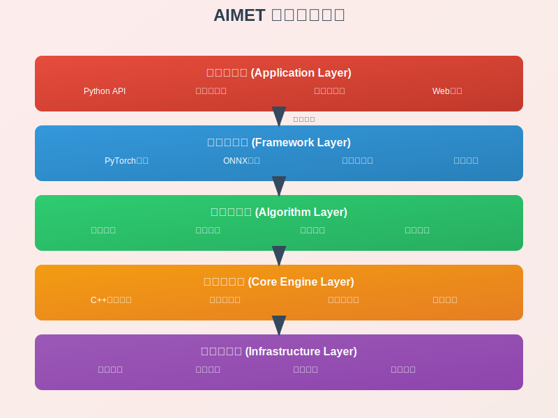
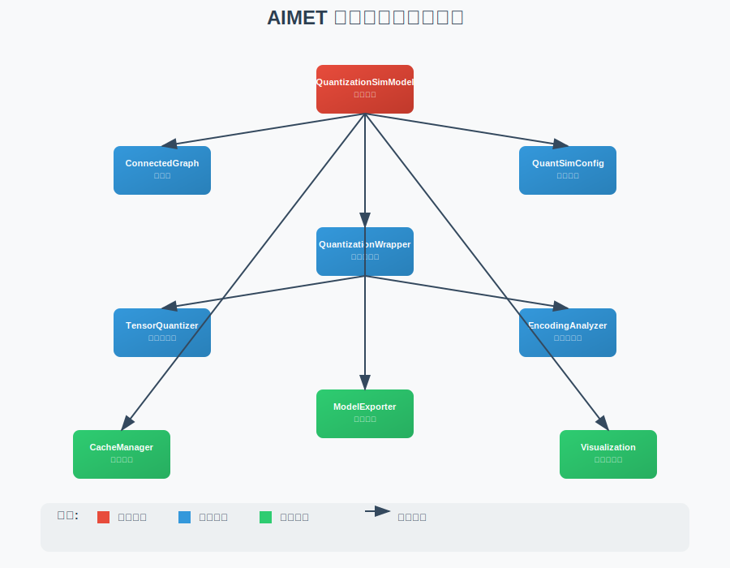

# AIMET 整体架构设计

## 1. 系统概述

AIMET（AI Model Efficiency Toolkit）是一个专注于深度学习模型效率优化的工具包，主要通过量化和压缩技术来提高模型的运行效率，降低计算负载和内存占用。

### 1.1 设计目标

- **模型量化**：将32位浮点模型转换为8位或更低精度的整数模型
- **模型压缩**：通过权重剪枝、SVD分解等技术减少模型参数
- **精度保持**：在优化过程中最小化模型精度损失
- **框架支持**：同时支持PyTorch和ONNX框架
- **边缘部署**：优化模型以适应移动设备和嵌入式系统

### 1.2 核心特性

- **先进的量化技术**：支持数据自由量化(DFQ)、自适应舍入(AdaRound)等先进算法
- **自动化优化**：提供AutoQuant等自动化工具，减少手动调优工作
- **可视化分析**：内置可视化工具帮助分析模型特征和优化效果
- **生产就绪**：提供完整的工具链支持从训练到部署的全流程

## 2. 架构层次设计

### 2.1 五层架构结构

**AIMET五层架构设计图**:



该架构图展示了：
- 🏗️ **应用接口层**: Python API、命令行工具、可视化界面
- 🔗 **框架适配层**: PyTorch支持、ONNX支持、通用接口层
- ⚙️ **算法实现层**: 量化算法、压缩算法、混合精度、自动优化
- 🔧 **核心引擎层**: C++量化引擎、张量量化器、编码分析器
- 🏠 **基础设施层**: 配置管理、缓存系统、测试框架、构建系统

### 2.2 模块依赖关系

**核心模块依赖关系图**:



该依赖图展示了：
- 🔴 **主控制器**: QuantizationSimModel作为系统的核心控制器
- 🔵 **核心模块**: ConnectedGraph、QuantSimConfig、QuantizationWrapper等核心组件
- 🟢 **工具模块**: ModelExporter、CacheManager、Visualization等辅助工具
- 🔗 **依赖关系**: 清晰的模块间依赖和调用关系

## 3. 核心模块划分

### 3.1 12个核心模块

1. **量化仿真模块** (QuantizationSimModel)
   - 管理整个模型的量化仿真过程
   - 协调各个子模块的工作
   - 提供用户主要交互接口

2. **张量量化器模块** (TensorQuantizer)
   - 执行单个张量的量化和反量化操作
   - 管理量化编码参数
   - 收集统计信息用于编码计算

3. **编码分析器模块** (EncodingAnalyzer)
   - 收集张量统计信息
   - 根据不同算法计算量化编码参数
   - 支持多种量化方案

4. **连接图模块** (ConnectedGraph)
   - 构建模型的计算图表示
   - 分析模块间的连接关系
   - 支持图遍历和分析

5. **量化配置模块** (QuantSimConfig)
   - 管理量化参数配置
   - 支持JSON配置文件
   - 提供配置验证机制

6. **自动量化模块** (AutoQuant)
   - 智能化的算法选择和参数调优
   - 自动为模型找到最佳的量化配置
   - 提供诊断和可视化功能

7. **模型压缩模块** (ModelCompression)
   - 实现权重剪枝、SVD分解等压缩算法
   - 支持压缩比选择和评估
   - 提供压缩效果分析

8. **混合精度模块** (MixedPrecision)
   - 支持不同层使用不同精度
   - 自动混合精度算法
   - 精度候选管理

9. **可视化模块** (Visualization)
   - 权重分布可视化
   - 量化敏感性分析
   - 模型压缩效果展示

10. **模型导出模块** (ModelExport)
    - 支持多种格式导出
    - 编码信息序列化
    - 部署优化

11. **缓存管理模块** (CacheManager)
    - 统计信息缓存
    - 编码参数缓存
    - 中间结果缓存

12. **工具集模块** (Utilities)
    - 通用工具函数
    - 数据处理工具
    - 调试辅助工具

## 4. 数据流设计

### 4.1 量化仿真数据流

```
Input Tensor
    ↓
Input Quantizer (TensorQuantizer)
    ↓
Quantized Input
    ↓
Original Module Computation
    ↓
Raw Output
    ↓
Output Quantizer (TensorQuantizer)
    ↓
Quantized Output
```

### 4.2 编码计算数据流

```
Forward Pass with Data
    ↓
Statistics Collection (EncodingAnalyzer)
    ↓
Encoding Computation
    ↓
Quantization Parameters (scale, offset)
    ↓
TensorQuantizer Configuration
```

## 5. 关键设计原则

### 5.1 模块化设计
- 每个模块职责单一，接口清晰
- 模块间通过标准接口通信
- 支持模块独立测试和替换

### 5.2 可扩展性
- 支持新的量化算法接入
- 支持新的框架适配
- 插件化架构设计

### 5.3 性能优化
- 核心计算使用C++实现
- 支持GPU加速
- 内存优化和缓存机制

### 5.4 易用性
- 简洁的Python API
- 详细的文档和示例
- 自动化工具减少手动配置

## 6. 技术栈选择

### 6.1 编程语言
- **Python**: 主要接口语言，易用性好
- **C++**: 性能关键部分，计算效率高
- **CUDA**: GPU加速支持

### 6.2 关键依赖
- **PyTorch**: 深度学习框架支持
- **ONNX**: 模型交换格式支持
- **NumPy**: 数值计算基础
- **pybind11**: Python-C++绑定
- **Eigen**: C++线性代数库

### 6.3 构建系统
- **CMake**: C++部分构建
- **setuptools**: Python包构建
- **Docker**: 容器化部署

## 7. 部署架构

### 7.1 包结构
```
aimet-torch/         # PyTorch支持包
aimet-onnx/          # ONNX支持包
aimet-common/        # 通用基础包
```

### 7.2 安装方式
- PyPI包安装
- Docker镜像
- 源码编译安装

### 7.3 运行环境
- Linux (Ubuntu 20.04+)
- Python 3.8+
- CUDA 11.0+ (可选)

## 8. 质量保证

### 8.1 测试策略
- 单元测试覆盖所有核心模块
- 集成测试验证模块间协作
- 性能测试确保效率要求

### 8.2 代码质量
- 代码审查机制
- 静态分析工具
- 文档完整性检查

### 8.3 持续集成
- 自动化构建和测试
- 多平台兼容性验证
- 性能回归检测

这个整体架构设计为AIMET系统提供了清晰的结构框架，确保了系统的可维护性、可扩展性和高性能。