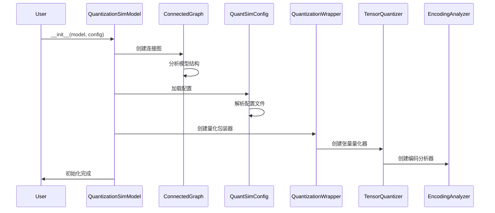
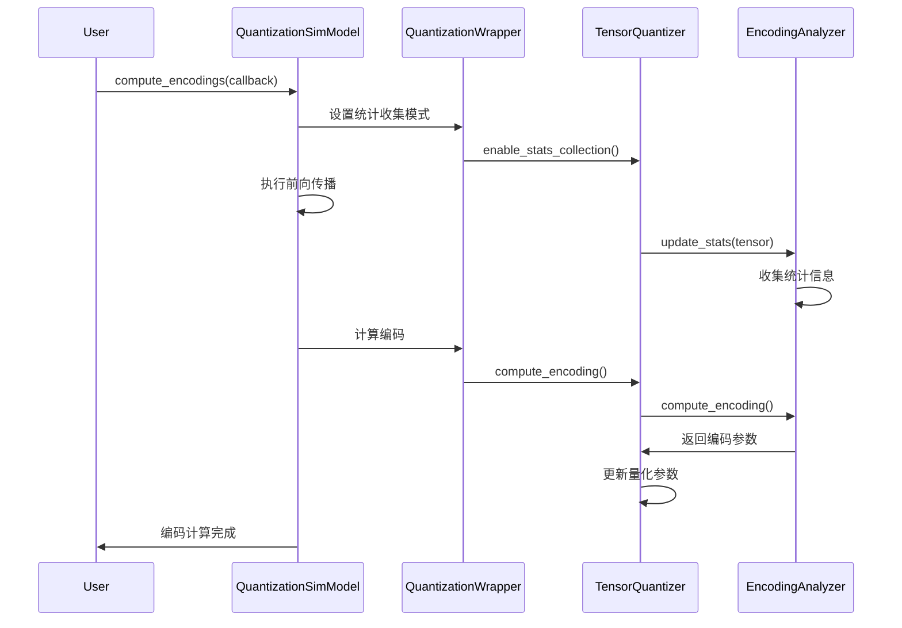
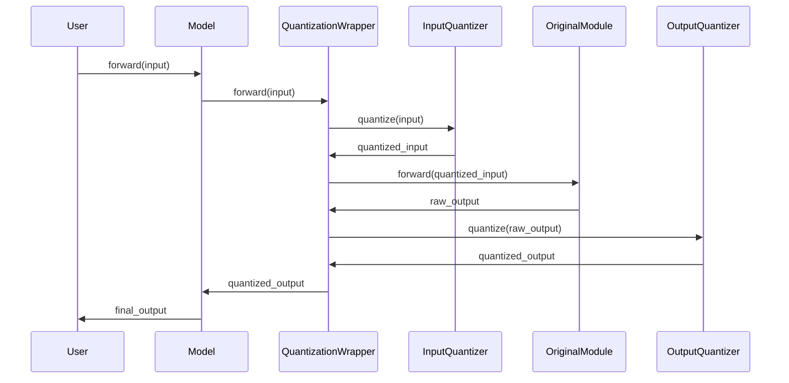

# 模块间交互机制设计

## 1. 交互机制概述

AIMET系统中的12个核心模块通过定义良好的接口进行交互，形成了一个协调统一的量化优化系统。本文档详细描述了各模块间的交互方式、数据流向和控制流程。

## 2. 核心交互模式

### 2.1 主控制器模式
```
QuantizationSimModel (主控制器)
├── ConnectedGraph (图分析)
├── QuantSimConfig (配置管理)
├── QuantizationWrapper[] (量化包装器)
│   ├── TensorQuantizer[] (张量量化器)
│   │   └── EncodingAnalyzer (编码分析器)
│   └── Original Module (原始模块)
└── ModelExporter (模型导出)
```

### 2.2 观察者模式
```
EncodingAnalyzer (被观察者)
├── 收集统计信息
├── 计算编码参数
└── 通知TensorQuantizer更新
```

### 2.3 策略模式
```
TensorQuantizer
├── MinMaxEncodingAnalyzer (最小最大值策略)
├── TfEnhancedEncodingAnalyzer (TF增强策略)
└── PercentileEncodingAnalyzer (百分位策略)
```

## 3. 详细交互流程

### 3.1 系统初始化阶段

#### 3.1.1 初始化序列图


#### 3.1.2 初始化交互代码示例
```python
class QuantizationSimModel:
    def __init__(self, model, config_file=None):
        # 1. 创建连接图分析模型结构
        self.connected_graph = ConnectedGraph(model)
        
        # 2. 加载配置
        self.config_manager = QuantSimConfig(config_file)
        
        # 3. 为每个模块创建量化包装器
        self._create_quantization_wrappers()
    
    def _create_quantization_wrappers(self):
        for op in self.connected_graph.get_all_ops():
            if self._should_quantize_op(op):
                wrapper = QuantizationWrapper(
                    op.module, 
                    self.config_manager.get_op_config(op.name)
                )
                self.quantization_wrappers[op.name] = wrapper
```

### 3.2 编码计算阶段

#### 3.2.1 编码计算序列图


#### 3.2.2 编码计算交互代码示例
```python
class QuantizationSimModel:
    def compute_encodings(self, forward_pass_callback, forward_pass_args):
        # 1. 设置所有量化器为统计收集模式
        self._set_encoding_computation_mode(True)
        
        # 2. 执行前向传播收集统计信息
        forward_pass_callback(self.model, forward_pass_args)
        
        # 3. 计算编码参数
        for wrapper in self.quantization_wrappers.values():
            wrapper.compute_encodings()
        
        # 4. 退出统计收集模式
        self._set_encoding_computation_mode(False)

class TensorQuantizer:
    def forward(self, input_tensor):
        if self.stats_collection_mode:
            # 统计收集模式：更新统计信息
            self.encoding_analyzer.update_stats(input_tensor)
            return input_tensor
        else:
            # 推理模式：执行量化
            return self.quantize_dequantize(input_tensor)
```

### 3.3 推理执行阶段

#### 3.3.1 推理执行序列图


#### 3.3.2 推理执行交互代码示例
```python
class QuantizationWrapper:
    def forward(self, *args, **kwargs):
        # 1. 量化输入
        quantized_inputs = []
        for i, input_tensor in enumerate(args):
            if i < len(self.input_quantizers):
                quantized_inputs.append(
                    self.input_quantizers[i](input_tensor)
                )
            else:
                quantized_inputs.append(input_tensor)
        
        # 2. 量化参数
        self._quantize_parameters()
        
        # 3. 执行原始模块计算
        output = self.original_module(*quantized_inputs, **kwargs)
        
        # 4. 量化输出
        if len(self.output_quantizers) > 0:
            output = self.output_quantizers[0](output)
        
        return output
```

## 4. 模块间通信接口

### 4.1 标准化接口定义

#### 4.1.1 量化器接口
```python
class IQuantizer(ABC):
    @abstractmethod
    def forward(self, input_tensor: torch.Tensor) -> torch.Tensor:
        """量化前向传播"""
        pass
    
    @abstractmethod
    def compute_encoding(self) -> None:
        """计算编码参数"""
        pass
    
    @abstractmethod
    def get_encoding(self) -> QuantizationEncoding:
        """获取编码参数"""
        pass
    
    @abstractmethod
    def set_encoding(self, encoding: QuantizationEncoding) -> None:
        """设置编码参数"""
        pass
```

#### 4.1.2 编码分析器接口
```python
class IEncodingAnalyzer(ABC):
    @abstractmethod
    def update_stats(self, tensor: torch.Tensor) -> None:
        """更新统计信息"""
        pass
    
    @abstractmethod
    def compute_encoding(self, bitwidth: int, symmetric: bool) -> QuantizationEncoding:
        """计算编码参数"""
        pass
    
    @abstractmethod
    def reset_stats(self) -> None:
        """重置统计信息"""
        pass
```

### 4.2 消息传递机制

#### 4.2.1 事件驱动通信
```python
class EventManager:
    def __init__(self):
        self.listeners = {}
    
    def register_listener(self, event_type, callback):
        """注册事件监听器"""
        if event_type not in self.listeners:
            self.listeners[event_type] = []
        self.listeners[event_type].append(callback)
    
    def emit_event(self, event_type, data):
        """发送事件"""
        if event_type in self.listeners:
            for callback in self.listeners[event_type]:
                callback(data)

# 使用示例
class TensorQuantizer:
    def __init__(self, event_manager):
        self.event_manager = event_manager
        # 监听编码更新事件
        self.event_manager.register_listener(
            'encoding_updated', 
            self.on_encoding_updated
        )
    
    def on_encoding_updated(self, encoding_data):
        """处理编码更新事件"""
        self.update_quantization_parameters(encoding_data)
```

#### 4.2.2 依赖注入机制
```python
class DependencyInjector:
    def __init__(self):
        self.dependencies = {}
    
    def register(self, interface, implementation):
        """注册依赖"""
        self.dependencies[interface] = implementation
    
    def get(self, interface):
        """获取依赖"""
        return self.dependencies.get(interface)

# 使用示例
injector = DependencyInjector()
injector.register(IEncodingAnalyzer, MinMaxEncodingAnalyzer)

class TensorQuantizer:
    def __init__(self, injector):
        self.encoding_analyzer = injector.get(IEncodingAnalyzer)()
```

## 5. 数据流管理

### 5.1 数据流向图
```
Input Data
    ↓
ConnectedGraph (分析数据流)
    ↓
QuantizationWrapper (包装数据流)
    ↓
TensorQuantizer (量化数据)
    ↓
EncodingAnalyzer (分析数据特征)
    ↓
CacheManager (缓存统计信息)
    ↓
Output Data
```

### 5.2 数据流控制机制

#### 5.2.1 流控制器
```python
class DataFlowController:
    def __init__(self):
        self.flow_state = FlowState.NORMAL
        self.checkpoints = {}
    
    def set_checkpoint(self, name, data):
        """设置检查点"""
        self.checkpoints[name] = data
    
    def restore_checkpoint(self, name):
        """恢复检查点"""
        return self.checkpoints.get(name)
    
    def pause_flow(self):
        """暂停数据流"""
        self.flow_state = FlowState.PAUSED
    
    def resume_flow(self):
        """恢复数据流"""
        self.flow_state = FlowState.NORMAL
```

#### 5.2.2 数据缓存机制
```python
class DataCache:
    def __init__(self, max_size=1000):
        self.cache = {}
        self.max_size = max_size
        self.access_order = []
    
    def get(self, key):
        """获取缓存数据"""
        if key in self.cache:
            self.access_order.remove(key)
            self.access_order.append(key)
            return self.cache[key]
        return None
    
    def put(self, key, value):
        """存储缓存数据"""
        if len(self.cache) >= self.max_size:
            # LRU淘汰策略
            oldest_key = self.access_order.pop(0)
            del self.cache[oldest_key]
        
        self.cache[key] = value
        self.access_order.append(key)
```

## 6. 错误处理和异常传播

### 6.1 异常处理机制
```python
class QuantizationError(Exception):
    """量化相关异常基类"""
    pass

class EncodingComputationError(QuantizationError):
    """编码计算异常"""
    pass

class QuantizationSimModel:
    def compute_encodings(self, callback, args):
        try:
            self._set_encoding_computation_mode(True)
            callback(self.model, args)
            
            for wrapper in self.quantization_wrappers.values():
                try:
                    wrapper.compute_encodings()
                except Exception as e:
                    raise EncodingComputationError(
                        f"Failed to compute encoding for {wrapper.name}: {str(e)}"
                    )
        except Exception as e:
            self._set_encoding_computation_mode(False)
            raise e
        finally:
            self._set_encoding_computation_mode(False)
```

### 6.2 状态一致性保证
```python
class StateManager:
    def __init__(self):
        self.state_stack = []
    
    @contextmanager
    def preserve_state(self, obj):
        """保存和恢复对象状态"""
        state = self._save_state(obj)
        self.state_stack.append(state)
        try:
            yield
        except Exception:
            self._restore_state(obj, state)
            raise
        finally:
            self.state_stack.pop()
    
    def _save_state(self, obj):
        """保存对象状态"""
        return copy.deepcopy(obj.__dict__)
    
    def _restore_state(self, obj, state):
        """恢复对象状态"""
        obj.__dict__.update(state)
```

## 7. 性能优化交互

### 7.1 异步处理机制
```python
import asyncio
from concurrent.futures import ThreadPoolExecutor

class AsyncQuantizationProcessor:
    def __init__(self, max_workers=4):
        self.executor = ThreadPoolExecutor(max_workers=max_workers)
    
    async def compute_encodings_async(self, quantizers):
        """异步计算编码"""
        tasks = []
        for quantizer in quantizers:
            task = asyncio.create_task(
                self._compute_encoding_async(quantizer)
            )
            tasks.append(task)
        
        results = await asyncio.gather(*tasks)
        return results
    
    async def _compute_encoding_async(self, quantizer):
        """异步计算单个量化器的编码"""
        loop = asyncio.get_event_loop()
        return await loop.run_in_executor(
            self.executor, 
            quantizer.compute_encoding
        )
```

### 7.2 批处理优化
```python
class BatchProcessor:
    def __init__(self, batch_size=32):
        self.batch_size = batch_size
        self.batch_buffer = []
    
    def add_to_batch(self, item):
        """添加项目到批处理缓冲区"""
        self.batch_buffer.append(item)
        if len(self.batch_buffer) >= self.batch_size:
            self.process_batch()
    
    def process_batch(self):
        """处理一批数据"""
        if not self.batch_buffer:
            return
        
        # 批量处理逻辑
        results = self._batch_compute(self.batch_buffer)
        self._distribute_results(results)
        
        self.batch_buffer.clear()
```

## 8. 调试和监控

### 8.1 模块间通信监控
```python
class CommunicationMonitor:
    def __init__(self):
        self.call_history = []
        self.performance_metrics = {}
    
    def log_call(self, caller, callee, method, args, result, duration):
        """记录模块间调用"""
        call_record = {
            'timestamp': time.time(),
            'caller': caller.__class__.__name__,
            'callee': callee.__class__.__name__,
            'method': method,
            'args_size': sys.getsizeof(args),
            'result_size': sys.getsizeof(result),
            'duration': duration
        }
        self.call_history.append(call_record)
    
    def get_performance_report(self):
        """生成性能报告"""
        return {
            'total_calls': len(self.call_history),
            'average_duration': np.mean([c['duration'] for c in self.call_history]),
            'hotspot_methods': self._find_hotspots()
        }
```

### 8.2 状态可视化
```python
class StateVisualizer:
    def __init__(self):
        self.state_snapshots = {}
    
    def capture_state(self, name, modules):
        """捕获模块状态快照"""
        snapshot = {}
        for module_name, module in modules.items():
            snapshot[module_name] = {
                'type': type(module).__name__,
                'state': self._extract_state(module),
                'memory_usage': self._get_memory_usage(module)
            }
        self.state_snapshots[name] = snapshot
    
    def visualize_interactions(self):
        """可视化模块间交互"""
        # 生成交互图
        pass
```

这个模块间交互机制设计确保了AIMET系统各模块间的高效协作和数据流管理，为系统的稳定性和性能提供了坚实的基础。