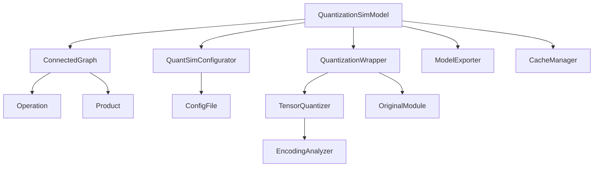

# 量化仿真模型 (QuantizationSimModel) 设计文档

## 1. 模块概述

### 1.1 职责定义
QuantizationSimModel是AIMET系统的核心控制模块，负责：
- 管理整个模型的量化仿真过程
- 协调各个子模块的工作
- 提供用户主要交互接口
- 控制量化流程的各个阶段

### 1.2 设计目标
- **统一接口**：为用户提供简洁一致的量化API
- **流程控制**：精确控制量化仿真的各个阶段
- **模块协调**：高效协调各子模块的工作
- **状态管理**：维护系统的全局状态一致性

## 2. 架构设计

### 2.1 类层次结构
```python
QuantizationSimModel
├── _QuantizationSimModelBase (基类)
├── ConnectedGraph (连接图)
├── QuantSimConfigurator (配置管理器)
├── QuantizationWrapper[] (量化包装器列表)
├── ModelExporter (模型导出器)
└── CacheManager (缓存管理器)
```

### 2.2 核心组件关系图


## 3. 详细设计

### 3.1 核心类定义

#### 3.1.1 主类结构
```python
class QuantizationSimModel:
    """量化仿真模型主控制器"""
    
    def __init__(self, 
                 model: torch.nn.Module,
                 quant_scheme: QuantScheme = QuantScheme.post_training_tf_enhanced,
                 default_output_bw: int = 8,
                 default_param_bw: int = 8,
                 config_file: str = None,
                 dummy_input: Union[torch.Tensor, Tuple] = None):
        """
        初始化量化仿真模型
        
        Args:
            model: 原始PyTorch模型
            quant_scheme: 量化方案
            default_output_bw: 默认输出位宽
            default_param_bw: 默认参数位宽
            config_file: 配置文件路径
            dummy_input: 用于模型分析的虚拟输入
        """
        self.model = model
        self.quant_scheme = quant_scheme
        self.default_output_bw = default_output_bw
        self.default_param_bw = default_param_bw
        self.dummy_input = dummy_input
        
        # 核心组件
        self.connected_graph = None
        self.quantization_wrappers = {}
        self.config_manager = None
        self.model_exporter = None
        self.cache_manager = CacheManager()
        
        # 状态标志
        self._encoding_computation_mode = False
        self._encodings_computed = False
        
        # 初始化系统
        self._initialize_components()
    
    def _initialize_components(self):
        """初始化各个组件"""
        # 1. 创建连接图分析模型结构
        self.connected_graph = ConnectedGraph(self.model, self.dummy_input)
        
        # 2. 加载配置管理器
        self.config_manager = QuantSimConfigurator(
            config_file, 
            self.quant_scheme,
            self.default_output_bw,
            self.default_param_bw
        )
        
        # 3. 创建量化包装器
        self._create_quantization_wrappers()
        
        # 4. 初始化模型导出器
        self.model_exporter = ModelExporter(self)
        
        # 5. 验证初始化结果
        self._validate_initialization()
```

#### 3.1.2 量化包装器管理
```python
def _create_quantization_wrappers(self):
    """为需要量化的模块创建包装器"""
    quantizable_ops = self._identify_quantizable_operations()
    
    for op in quantizable_ops:
        # 获取操作的配置
        op_config = self.config_manager.get_op_config(op.name, op.type)
        
        if op_config.is_quantizable:
            # 创建量化包装器
            wrapper = QuantizationWrapper(
                original_module=op.module,
                module_name=op.name,
                op_config=op_config,
                connected_graph_op=op
            )
            
            self.quantization_wrappers[op.name] = wrapper
            
            # 替换原始模块
            self._replace_module_with_wrapper(op.name, wrapper)

def _identify_quantizable_operations(self):
    """识别可量化的操作"""
    quantizable_ops = []
    
    for op in self.connected_graph.get_all_ops().values():
        if self._is_quantizable_operation(op):
            quantizable_ops.append(op)
    
    return quantizable_ops

def _is_quantizable_operation(self, op):
    """判断操作是否可量化"""
    # 检查操作类型
    if not self._is_supported_op_type(op.type):
        return False
    
    # 检查是否在忽略列表中
    if self.config_manager.is_op_ignored(op.name):
        return False
    
    # 检查是否有权重参数
    if not self._has_quantizable_parameters(op.module):
        return False
    
    return True

def _replace_module_with_wrapper(self, module_name, wrapper):
    """用量化包装器替换原始模块"""
    # 解析模块路径
    path_parts = module_name.split('.')
    parent_module = self.model
    
    # 导航到父模块
    for part in path_parts[:-1]:
        parent_module = getattr(parent_module, part)
    
    # 替换最后一级模块
    setattr(parent_module, path_parts[-1], wrapper)
```

### 3.2 编码计算流程

#### 3.2.1 编码计算主函数
```python
def compute_encodings(self, 
                     forward_pass_callback: Callable,
                     forward_pass_callback_args: Any = None) -> None:
    """
    计算量化编码参数
    
    Args:
        forward_pass_callback: 前向传播回调函数
        forward_pass_callback_args: 回调函数参数
    """
    try:
        # 1. 验证前置条件
        self._validate_encoding_computation_preconditions()
        
        # 2. 设置编码计算模式
        self._set_encoding_computation_mode(True)
        
        # 3. 重置所有统计信息
        self._reset_all_encoding_stats()
        
        # 4. 执行前向传播收集统计信息
        self._collect_statistics(forward_pass_callback, forward_pass_callback_args)
        
        # 5. 计算编码参数
        self._compute_all_encodings()
        
        # 6. 验证编码结果
        self._validate_computed_encodings()
        
        # 7. 缓存编码结果
        self._cache_encodings()
        
        # 8. 更新状态标志
        self._encodings_computed = True
        
    except Exception as e:
        # 错误处理和状态恢复
        self._handle_encoding_computation_error(e)
        raise
    finally:
        # 确保退出编码计算模式
        self._set_encoding_computation_mode(False)

def _collect_statistics(self, callback, callback_args):
    """收集统计信息"""
    logger.info("开始收集量化统计信息...")
    
    # 设置模型为评估模式
    original_training_mode = self.model.training
    self.model.eval()
    
    try:
        with torch.no_grad():
            if callback_args is not None:
                callback(self.model, callback_args)
            else:
                callback(self.model)
    finally:
        # 恢复原始训练模式
        self.model.train(original_training_mode)
    
    logger.info("统计信息收集完成")

def _compute_all_encodings(self):
    """计算所有量化器的编码参数"""
    logger.info("开始计算量化编码参数...")
    
    encoding_errors = []
    
    for wrapper_name, wrapper in self.quantization_wrappers.items():
        try:
            wrapper.compute_encodings()
        except Exception as e:
            error_msg = f"Failed to compute encodings for {wrapper_name}: {str(e)}"
            encoding_errors.append(error_msg)
            logger.error(error_msg)
    
    if encoding_errors:
        raise RuntimeError(f"Encoding computation failed for {len(encoding_errors)} wrappers:\n" + 
                          "\n".join(encoding_errors))
    
    logger.info("编码参数计算完成")
```

#### 3.2.2 状态管理
```python
def _set_encoding_computation_mode(self, enabled: bool):
    """设置编码计算模式"""
    self._encoding_computation_mode = enabled
    
    # 通知所有量化包装器
    for wrapper in self.quantization_wrappers.values():
        wrapper.set_encoding_computation_mode(enabled)
    
    logger.debug(f"编码计算模式设置为: {enabled}")

def _reset_all_encoding_stats(self):
    """重置所有编码统计信息"""
    for wrapper in self.quantization_wrappers.values():
        wrapper.reset_encoding_stats()

def _validate_encoding_computation_preconditions(self):
    """验证编码计算的前置条件"""
    if not self.quantization_wrappers:
        raise RuntimeError("No quantization wrappers found. Model may not be quantizable.")
    
    # 检查每个包装器是否准备就绪
    for wrapper_name, wrapper in self.quantization_wrappers.items():
        if not wrapper.is_ready_for_encoding_computation():
            raise RuntimeError(f"Wrapper {wrapper_name} is not ready for encoding computation")
```

### 3.3 模型推理和导出

#### 3.3.1 推理执行
```python
def forward(self, *args, **kwargs):
    """模型前向传播"""
    if not self._encodings_computed and not self._encoding_computation_mode:
        logger.warning("Encodings not computed. Running in floating-point mode.")
    
    return self.model(*args, **kwargs)

def __call__(self, *args, **kwargs):
    """使模型可调用"""
    return self.forward(*args, **kwargs)

def eval(self):
    """设置模型为评估模式"""
    self.model.eval()
    return self

def train(self, mode: bool = True):
    """设置模型训练模式"""
    self.model.train(mode)
    return self
```

#### 3.3.2 模型导出
```python
def export(self, 
           path: str, 
           filename_prefix: str, 
           dummy_input: torch.Tensor,
           export_format: str = 'onnx',
           export_encodings: bool = True) -> Tuple[str, str]:
    """
    导出量化模型
    
    Args:
        path: 导出路径
        filename_prefix: 文件名前缀
        dummy_input: 用于导出的虚拟输入
        export_format: 导出格式 ('onnx', 'torchscript')
        export_encodings: 是否导出编码信息
    
    Returns:
        Tuple[模型文件路径, 编码文件路径]
    """
    if not self._encodings_computed:
        raise RuntimeError("Encodings must be computed before export")
    
    return self.model_exporter.export(
        path, filename_prefix, dummy_input, export_format, export_encodings
    )
```

### 3.4 配置和状态管理

#### 3.4.1 配置管理接口
```python
def set_quantizer_config(self, 
                        module_name: str, 
                        quantizer_type: str,
                        config: Dict):
    """设置特定量化器的配置"""
    if module_name not in self.quantization_wrappers:
        raise ValueError(f"Module {module_name} not found in quantization wrappers")
    
    wrapper = self.quantization_wrappers[module_name]
    wrapper.set_quantizer_config(quantizer_type, config)

def get_quantizer_config(self, module_name: str, quantizer_type: str) -> Dict:
    """获取特定量化器的配置"""
    if module_name not in self.quantization_wrappers:
        raise ValueError(f"Module {module_name} not found in quantization wrappers")
    
    wrapper = self.quantization_wrappers[module_name]
    return wrapper.get_quantizer_config(quantizer_type)

def enable_quantizer(self, module_name: str, quantizer_type: str):
    """启用特定量化器"""
    self._set_quantizer_enabled(module_name, quantizer_type, True)

def disable_quantizer(self, module_name: str, quantizer_type: str):
    """禁用特定量化器"""
    self._set_quantizer_enabled(module_name, quantizer_type, False)
```

#### 3.4.2 状态查询接口
```python
def get_quantization_summary(self) -> Dict:
    """获取量化状态摘要"""
    summary = {
        'total_wrappers': len(self.quantization_wrappers),
        'encodings_computed': self._encodings_computed,
        'quantizable_ops': [],
        'quantizer_states': {}
    }
    
    for wrapper_name, wrapper in self.quantization_wrappers.items():
        op_info = {
            'name': wrapper_name,
            'type': wrapper.original_module.__class__.__name__,
            'input_quantizers': len(wrapper.input_quantizers),
            'output_quantizers': len(wrapper.output_quantizers),
            'param_quantizers': len(wrapper.param_quantizers)
        }
        summary['quantizable_ops'].append(op_info)
        summary['quantizer_states'][wrapper_name] = wrapper.get_state_summary()
    
    return summary

def check_model_quantization_readiness(self) -> Dict:
    """检查模型量化就绪状态"""
    readiness_report = {
        'ready': True,
        'issues': [],
        'warnings': []
    }
    
    # 检查是否有量化包装器
    if not self.quantization_wrappers:
        readiness_report['ready'] = False
        readiness_report['issues'].append("No quantizable operations found")
    
    # 检查每个包装器的状态
    for wrapper_name, wrapper in self.quantization_wrappers.items():
        wrapper_issues = wrapper.check_readiness()
        if wrapper_issues:
            readiness_report['issues'].extend(
                [f"{wrapper_name}: {issue}" for issue in wrapper_issues]
            )
    
    if readiness_report['issues']:
        readiness_report['ready'] = False
    
    return readiness_report
```

## 4. 错误处理和异常管理

### 4.1 异常类型定义
```python
class QuantizationSimError(Exception):
    """量化仿真相关异常基类"""
    pass

class InitializationError(QuantizationSimError):
    """初始化异常"""
    pass

class EncodingComputationError(QuantizationSimError):
    """编码计算异常"""
    pass

class ExportError(QuantizationSimError):
    """导出异常"""
    pass
```

### 4.2 错误处理机制
```python
def _handle_encoding_computation_error(self, error):
    """处理编码计算错误"""
    logger.error(f"Encoding computation failed: {str(error)}")
    
    # 重置状态
    self._encodings_computed = False
    self._encoding_computation_mode = False
    
    # 清理部分计算结果
    self._cleanup_partial_encodings()
    
    # 记录错误信息
    self.cache_manager.cache_error_info(error)

def _cleanup_partial_encodings(self):
    """清理部分编码结果"""
    for wrapper in self.quantization_wrappers.values():
        wrapper.cleanup_partial_encodings()
```

## 5. 性能优化

### 5.1 并行处理
```python
import concurrent.futures
from typing import List

def _compute_all_encodings_parallel(self):
    """并行计算编码参数"""
    with concurrent.futures.ThreadPoolExecutor(max_workers=4) as executor:
        # 提交所有编码计算任务
        future_to_wrapper = {
            executor.submit(wrapper.compute_encodings): wrapper_name
            for wrapper_name, wrapper in self.quantization_wrappers.items()
        }
        
        # 收集结果
        encoding_errors = []
        for future in concurrent.futures.as_completed(future_to_wrapper):
            wrapper_name = future_to_wrapper[future]
            try:
                future.result()
            except Exception as e:
                error_msg = f"Failed to compute encodings for {wrapper_name}: {str(e)}"
                encoding_errors.append(error_msg)
        
        if encoding_errors:
            raise RuntimeError("Parallel encoding computation failed:\n" + 
                             "\n".join(encoding_errors))
```

### 5.2 内存优化
```python
def _optimize_memory_usage(self):
    """优化内存使用"""
    # 清理不需要的中间结果
    for wrapper in self.quantization_wrappers.values():
        wrapper.cleanup_intermediate_results()
    
    # 触发垃圾回收
    import gc
    gc.collect()
    
    if torch.cuda.is_available():
        torch.cuda.empty_cache()
```

## 6. 调试和监控

### 6.1 调试接口
```python
def enable_debug_mode(self):
    """启用调试模式"""
    self._debug_mode = True
    logging.getLogger().setLevel(logging.DEBUG)

def get_debug_info(self) -> Dict:
    """获取调试信息"""
    return {
        'model_structure': str(self.connected_graph),
        'quantization_wrappers': list(self.quantization_wrappers.keys()),
        'encoding_computation_mode': self._encoding_computation_mode,
        'encodings_computed': self._encodings_computed,
        'memory_usage': self._get_memory_usage()
    }

def _get_memory_usage(self) -> Dict:
    """获取内存使用情况"""
    import psutil
    process = psutil.Process()
    
    return {
        'rss_mb': process.memory_info().rss / 1024 / 1024,
        'vms_mb': process.memory_info().vms / 1024 / 1024,
        'gpu_memory_mb': torch.cuda.memory_allocated() / 1024 / 1024 if torch.cuda.is_available() else 0
    }
```

### 6.2 监控和日志
```python
import logging

def _setup_logging(self):
    """设置日志系统"""
    logger = logging.getLogger('aimet.quantsim')
    logger.setLevel(logging.INFO)
    
    handler = logging.StreamHandler()
    formatter = logging.Formatter(
        '%(asctime)s - %(name)s - %(levelname)s - %(message)s'
    )
    handler.setFormatter(formatter)
    logger.addHandler(handler)
    
    return logger

def _log_quantization_statistics(self):
    """记录量化统计信息"""
    stats = self.get_quantization_summary()
    logger.info(f"Quantization Summary: {stats}")
```

这个QuantizationSimModel设计提供了完整的量化仿真控制功能，具有良好的可扩展性、错误处理能力和性能优化特性，是AIMET系统的核心控制模块。