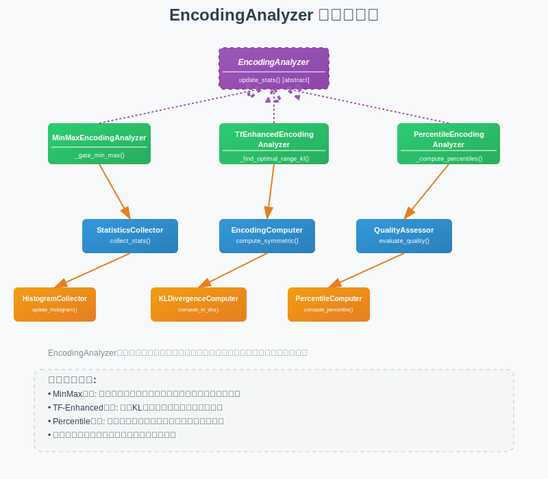

# 编码分析器 (EncodingAnalyzer) 设计文档

## 1. 模块概述

### 1.1 职责定义
EncodingAnalyzer是AIMET系统中负责分析张量统计特征并计算量化编码参数的核心模块，主要职责包括：
- 收集和维护张量的统计信息
- 根据不同的量化算法计算编码参数
- 支持多种编码计算策略（MinMax、TF-Enhanced、Percentile等）
- 提供编码质量评估和优化功能

### 1.2 设计目标
- **准确性**：精确计算最优的量化编码参数
- **多样性**：支持多种量化算法和策略
- **效率性**：高效的统计信息收集和处理
- **可扩展性**：易于添加新的编码算法

## 2. 架构设计

### 2.1 类层次结构
**EncodingAnalyzer类层次结构图**:



类层次结构说明：
- 🟣 **抽象基类**: EncodingAnalyzer用紫色虚线框和斜体表示，定义编码分析接口
- 🟢 **具体实现**: MinMax、TF-Enhanced、Percentile三种主要的编码分析器实现
- 🔵 **组件模块**: StatisticsCollector、EncodingComputer、QualityAssessor等协作组件
- 🟠 **工具模块**: HistogramCollector、KLDivergenceComputer等专用工具
- 🔗 **组合关系**: 实线箭头展示各组件间的组合和依赖关系
- 📊 **算法分类**: 每种算法都有对应的工具组件支持，形成完整的算法生态

### 2.2 核心组件关系
**组件协作架构**: 在可视化图表中可以看到EncodingAnalyzer的完整生态系统：

**统计收集层**:
- **StatisticsCollector**: 统计信息收集的协调器
- **HistogramCollector**: 直方图数据收集
- **MinMaxCollector**: 最小最大值收集
- **PercentileCollector**: 百分位数据收集

**编码计算层**:
- **EncodingComputer**: 编码参数计算的协调器
- **SymmetricComputer**: 对称编码计算
- **AsymmetricComputer**: 非对称编码计算
- **KLDivergenceComputer**: KL散度优化计算

**质量验证层**:
- **EncodingValidator**: 编码参数验证
- **QualityAssessor**: 编码质量评估

图表展示了这些组件如何协同工作来实现高质量的量化编码计算。

## 3. 详细设计

### 3.1 基础抽象类

#### 3.1.1 EncodingAnalyzer基类
```python
from abc import ABC, abstractmethod
import torch
import numpy as np
from typing import Optional, Dict, Any
import logging

logger = logging.getLogger(__name__)

class EncodingAnalyzer(ABC):
    """编码分析器抽象基类"""
    
    def __init__(self):
        self.stats_updated = False
        self._reset_stats()
    
    def _reset_stats(self):
        """重置统计信息 - 子类可重写"""
        self.stats_updated = False
    
    @abstractmethod
    def update_stats(self, tensor: torch.Tensor) -> None:
        """
        更新统计信息
        
        Args:
            tensor: 输入张量
        """
        pass
    
    @abstractmethod
    def compute_encoding(self, 
                        bitwidth: int, 
                        use_symmetric: bool) -> 'QuantizationEncoding':
        """
        计算量化编码参数
        
        Args:
            bitwidth: 量化位宽
            use_symmetric: 是否使用对称编码
            
        Returns:
            量化编码对象
        """
        pass
    
    def reset_stats(self) -> None:
        """重置统计信息"""
        self._reset_stats()
    
    def get_stats_summary(self) -> Dict[str, Any]:
        """获取统计信息摘要"""
        return {
            'stats_updated': self.stats_updated,
            'analyzer_type': self.__class__.__name__
        }
    
    def validate_tensor(self, tensor: torch.Tensor) -> None:
        """验证输入张量"""
        if not isinstance(tensor, torch.Tensor):
            raise TypeError("Input must be a torch.Tensor")
        
        if tensor.numel() == 0:
            raise ValueError("Input tensor is empty")
        
        if torch.isnan(tensor).any():
            logger.warning("Input tensor contains NaN values")
        
        if torch.isinf(tensor).any():
            logger.warning("Input tensor contains Inf values")
```

### 3.2 MinMax编码分析器

#### 3.2.1 MinMaxEncodingAnalyzer实现
```python
class MinMaxEncodingAnalyzer(EncodingAnalyzer):
    """最小最大值编码分析器"""
    
    def __init__(self):
        super().__init__()
        self.min_val = float('inf')
        self.max_val = float('-inf')
        self.num_updates = 0
    
    def _reset_stats(self):
        """重置统计信息"""
        super()._reset_stats()
        self.min_val = float('inf')
        self.max_val = float('-inf')
        self.num_updates = 0
    
    def update_stats(self, tensor: torch.Tensor) -> None:
        """更新最小最大值统计"""
        self.validate_tensor(tensor)
        
        # 计算当前张量的最小最大值
        current_min = tensor.min().item()
        current_max = tensor.max().item()
        
        # 更新全局最小最大值
        self.min_val = min(self.min_val, current_min)
        self.max_val = max(self.max_val, current_max)
        
        self.num_updates += 1
        self.stats_updated = True
        
        logger.debug(f"Updated stats: min={self.min_val:.6f}, max={self.max_val:.6f}")
    
    def compute_encoding(self, 
                        bitwidth: int, 
                        use_symmetric: bool) -> 'QuantizationEncoding':
        """计算MinMax编码"""
        if not self.stats_updated:
            raise RuntimeError("No statistics available for encoding computation")
        
        # 确保量化范围包含零点
        min_val, max_val = self._gate_min_max(self.min_val, self.max_val)
        
        if use_symmetric:
            encoding = self._compute_symmetric_encoding(min_val, max_val, bitwidth)
        else:
            encoding = self._compute_asymmetric_encoding(min_val, max_val, bitwidth)
        
        logger.info(f"Computed MinMax encoding: {encoding}")
        return encoding
    
    def _gate_min_max(self, min_val: float, max_val: float) -> tuple:
        """确保量化范围包含零点"""
        # 确保范围包含0
        min_val = min(min_val, 0.0)
        max_val = max(max_val, 0.0)
        
        # 确保有最小范围避免除零错误
        min_range = 1e-7
        if abs(max_val - min_val) < min_range:
            if max_val > 0:
                max_val += min_range / 2
                min_val -= min_range / 2
            else:
                max_val = min_range / 2
                min_val = -min_range / 2
        
        return min_val, max_val
    
    def _compute_symmetric_encoding(self, 
                                   min_val: float, 
                                   max_val: float, 
                                   bitwidth: int) -> 'QuantizationEncoding':
        """计算对称编码"""
        max_abs = max(abs(min_val), abs(max_val))
        
        # 对称量化的量化级别数
        num_steps = 2**(bitwidth - 1) - 1
        
        # 计算scale和offset
        scale = max_abs / num_steps
        offset = -num_steps
        
        # 重新计算精确的min和max
        actual_min = offset * scale
        actual_max = num_steps * scale
        
        return QuantizationEncoding(
            min=actual_min,
            max=actual_max,
            scale=scale,
            offset=offset,
            bitwidth=bitwidth,
            symmetric=True
        )
    
    def _compute_asymmetric_encoding(self, 
                                    min_val: float, 
                                    max_val: float, 
                                    bitwidth: int) -> 'QuantizationEncoding':
        """计算非对称编码"""
        # 非对称量化的量化级别数
        num_steps = 2**bitwidth - 1
        
        # 计算scale和offset
        scale = (max_val - min_val) / num_steps
        offset = round(min_val / scale)
        
        # 重新计算精确的min和max
        actual_min = offset * scale
        actual_max = actual_min + num_steps * scale
        
        return QuantizationEncoding(
            min=actual_min,
            max=actual_max,
            scale=scale,
            offset=offset,
            bitwidth=bitwidth,
            symmetric=False
        )
    
    def get_stats_summary(self) -> Dict[str, Any]:
        """获取统计摘要"""
        summary = super().get_stats_summary()
        summary.update({
            'min_val': self.min_val if self.stats_updated else None,
            'max_val': self.max_val if self.stats_updated else None,
            'num_updates': self.num_updates,
            'range': self.max_val - self.min_val if self.stats_updated else None
        })
        return summary
```

### 3.3 TF增强编码分析器

#### 3.3.1 TfEnhancedEncodingAnalyzer实现
```python
class TfEnhancedEncodingAnalyzer(EncodingAnalyzer):
    """TensorFlow增强编码分析器（基于KL散度）"""
    
    def __init__(self, num_bins: int = 2048):
        super().__init__()
        self.num_bins = num_bins
        self.histogram = None
        self.bin_edges = None
        self.total_samples = 0
        self.min_val = float('inf')
        self.max_val = float('-inf')
    
    def _reset_stats(self):
        """重置统计信息"""
        super()._reset_stats()
        self.histogram = None
        self.bin_edges = None
        self.total_samples = 0
        self.min_val = float('inf')
        self.max_val = float('-inf')
    
    def update_stats(self, tensor: torch.Tensor) -> None:
        """更新直方图统计"""
        self.validate_tensor(tensor)
        
        # 更新最小最大值
        current_min = tensor.min().item()
        current_max = tensor.max().item()
        self.min_val = min(self.min_val, current_min)
        self.max_val = max(self.max_val, current_max)
        
        # 初始化或更新直方图
        if self.histogram is None:
            self._initialize_histogram(tensor)
        else:
            self._update_histogram(tensor)
        
        self.total_samples += tensor.numel()
        self.stats_updated = True
    
    def _initialize_histogram(self, tensor: torch.Tensor) -> None:
        """初始化直方图"""
        min_val, max_val = tensor.min().item(), tensor.max().item()
        
        # 创建bin边界
        self.bin_edges = torch.linspace(min_val, max_val, self.num_bins + 1)
        
        # 计算直方图
        self.histogram = torch.histc(
            tensor.float(), 
            bins=self.num_bins, 
            min=min_val, 
            max=max_val
        )
    
    def _update_histogram(self, tensor: torch.Tensor) -> None:
        """更新直方图"""
        # 扩展bin范围如果需要
        current_min, current_max = tensor.min().item(), tensor.max().item()
        
        if current_min < self.bin_edges[0] or current_max > self.bin_edges[-1]:
            self._expand_histogram_range(current_min, current_max)
        
        # 计算新的直方图并累加
        new_histogram = torch.histc(
            tensor.float(),
            bins=self.num_bins,
            min=self.bin_edges[0].item(),
            max=self.bin_edges[-1].item()
        )
        
        self.histogram += new_histogram
    
    def _expand_histogram_range(self, new_min: float, new_max: float) -> None:
        """扩展直方图范围"""
        old_min = self.bin_edges[0].item()
        old_max = self.bin_edges[-1].item()
        
        # 计算新的范围
        expanded_min = min(old_min, new_min)
        expanded_max = max(old_max, new_max)
        
        # 重新计算bin边界
        new_bin_edges = torch.linspace(expanded_min, expanded_max, self.num_bins + 1)
        
        # 重新分布现有的直方图数据
        new_histogram = self._redistribute_histogram(
            self.histogram, self.bin_edges, new_bin_edges
        )
        
        self.bin_edges = new_bin_edges
        self.histogram = new_histogram
    
    def _redistribute_histogram(self, 
                               old_histogram: torch.Tensor,
                               old_edges: torch.Tensor,
                               new_edges: torch.Tensor) -> torch.Tensor:
        """重新分布直方图数据"""
        # 简化实现：线性插值重分布
        # 实际实现可能需要更精确的重分布算法
        new_histogram = torch.zeros(len(new_edges) - 1)
        
        for i, count in enumerate(old_histogram):
            if count > 0:
                # 找到旧bin在新bin中的位置
                old_center = (old_edges[i] + old_edges[i + 1]) / 2
                new_bin_idx = torch.searchsorted(new_edges, old_center) - 1
                new_bin_idx = torch.clamp(new_bin_idx, 0, len(new_histogram) - 1)
                new_histogram[new_bin_idx] += count
        
        return new_histogram
    
    def compute_encoding(self, 
                        bitwidth: int, 
                        use_symmetric: bool) -> 'QuantizationEncoding':
        """使用KL散度计算最优编码"""
        if not self.stats_updated or self.histogram is None:
            raise RuntimeError("No histogram data available for encoding computation")
        
        # 使用KL散度找到最优量化范围
        optimal_min, optimal_max = self._find_optimal_range_kl_divergence(bitwidth)
        
        if use_symmetric:
            max_abs = max(abs(optimal_min), abs(optimal_max))
            optimal_min, optimal_max = -max_abs, max_abs
        
        # 计算编码参数
        if use_symmetric:
            num_steps = 2**(bitwidth - 1) - 1
            scale = optimal_max / num_steps
            offset = -num_steps
        else:
            num_steps = 2**bitwidth - 1
            scale = (optimal_max - optimal_min) / num_steps
            offset = round(optimal_min / scale)
        
        return QuantizationEncoding(
            min=optimal_min,
            max=optimal_max,
            scale=scale,
            offset=offset,
            bitwidth=bitwidth,
            symmetric=use_symmetric
        )
    
    def _find_optimal_range_kl_divergence(self, bitwidth: int) -> tuple:
        """使用KL散度找到最优量化范围"""
        num_quantization_bins = 2**bitwidth
        
        # 归一化直方图得到概率分布
        total_count = self.histogram.sum()
        prob_dist = self.histogram / total_count
        
        # 搜索最优的截断点
        best_kl_div = float('inf')
        best_threshold_idx = len(prob_dist) - 1
        
        # 从高百分位开始搜索
        start_idx = int(len(prob_dist) * 0.9)
        
        for threshold_idx in range(start_idx, len(prob_dist)):
            # 截断分布
            truncated_dist = prob_dist[:threshold_idx + 1].clone()
            
            # 重新归一化
            truncated_sum = truncated_dist.sum()
            if truncated_sum > 0:
                truncated_dist /= truncated_sum
            
            # 量化截断后的分布
            quantized_dist = self._quantize_distribution(
                truncated_dist, num_quantization_bins
            )
            
            # 计算KL散度
            kl_div = self._compute_kl_divergence(truncated_dist, quantized_dist)
            
            if kl_div < best_kl_div:
                best_kl_div = kl_div
                best_threshold_idx = threshold_idx
        
        # 根据最优阈值计算量化范围
        threshold_value = self.bin_edges[best_threshold_idx].item()
        
        # 对称处理
        if abs(self.min_val) > threshold_value:
            optimal_min = -threshold_value
        else:
            optimal_min = self.min_val
        
        optimal_max = threshold_value
        
        return optimal_min, optimal_max
    
    def _quantize_distribution(self, 
                              dist: torch.Tensor, 
                              num_bins: int) -> torch.Tensor:
        """量化概率分布"""
        if len(dist) <= num_bins:
            return dist
        
        # 将原分布合并到指定数量的bins中
        bin_size = len(dist) / num_bins
        quantized = torch.zeros(num_bins)
        
        for i in range(num_bins):
            start_idx = int(i * bin_size)
            end_idx = int((i + 1) * bin_size)
            quantized[i] = dist[start_idx:end_idx].sum()
        
        return quantized
    
    def _compute_kl_divergence(self, 
                              p: torch.Tensor, 
                              q: torch.Tensor) -> float:
        """计算KL散度"""
        # 避免log(0)
        epsilon = 1e-10
        p = p + epsilon
        q = q + epsilon
        
        # 确保是概率分布
        p = p / p.sum()
        q = q / q.sum()
        
        # 计算KL散度
        kl_div = torch.sum(p * torch.log(p / q))
        return kl_div.item()
    
    def get_stats_summary(self) -> Dict[str, Any]:
        """获取统计摘要"""
        summary = super().get_stats_summary()
        summary.update({
            'min_val': self.min_val if self.stats_updated else None,
            'max_val': self.max_val if self.stats_updated else None,
            'total_samples': self.total_samples,
            'num_bins': self.num_bins,
            'histogram_initialized': self.histogram is not None
        })
        return summary
```

### 3.4 百分位编码分析器

#### 3.4.1 PercentileEncodingAnalyzer实现
```python
class PercentileEncodingAnalyzer(EncodingAnalyzer):
    """百分位编码分析器"""
    
    def __init__(self, percentile: float = 99.99):
        super().__init__()
        self.percentile = percentile
        self.collected_data = []
        self.max_samples = 100000  # 限制内存使用
    
    def _reset_stats(self):
        """重置统计信息"""
        super()._reset_stats()
        self.collected_data.clear()
    
    def update_stats(self, tensor: torch.Tensor) -> None:
        """收集数据样本"""
        self.validate_tensor(tensor)
        
        # 随机采样以限制内存使用
        flattened = tensor.flatten()
        
        if len(self.collected_data) + len(flattened) > self.max_samples:
            # 随机采样
            num_to_sample = self.max_samples - len(self.collected_data)
            if num_to_sample > 0:
                indices = torch.randperm(len(flattened))[:num_to_sample]
                samples = flattened[indices]
                self.collected_data.extend(samples.tolist())
        else:
            self.collected_data.extend(flattened.tolist())
        
        self.stats_updated = True
    
    def compute_encoding(self, 
                        bitwidth: int, 
                        use_symmetric: bool) -> 'QuantizationEncoding':
        """基于百分位计算编码"""
        if not self.stats_updated or not self.collected_data:
            raise RuntimeError("No data collected for percentile computation")
        
        # 转换为numpy数组进行百分位计算
        data = np.array(self.collected_data)
        
        # 计算百分位值
        lower_percentile = (100 - self.percentile) / 2
        upper_percentile = 100 - lower_percentile
        
        min_val = np.percentile(data, lower_percentile)
        max_val = np.percentile(data, upper_percentile)
        
        # 确保包含零点
        min_val = min(min_val, 0.0)
        max_val = max(max_val, 0.0)
        
        if use_symmetric:
            max_abs = max(abs(min_val), abs(max_val))
            min_val, max_val = -max_abs, max_abs
        
        # 计算编码参数
        if use_symmetric:
            num_steps = 2**(bitwidth - 1) - 1
            scale = max_val / num_steps
            offset = -num_steps
        else:
            num_steps = 2**bitwidth - 1
            scale = (max_val - min_val) / num_steps
            offset = round(min_val / scale)
        
        return QuantizationEncoding(
            min=min_val,
            max=max_val,
            scale=scale,
            offset=offset,
            bitwidth=bitwidth,
            symmetric=use_symmetric
        )
    
    def get_stats_summary(self) -> Dict[str, Any]:
        """获取统计摘要"""
        summary = super().get_stats_summary()
        
        if self.collected_data:
            data = np.array(self.collected_data)
            summary.update({
                'percentile': self.percentile,
                'num_samples': len(self.collected_data),
                'data_min': float(np.min(data)),
                'data_max': float(np.max(data)),
                'data_mean': float(np.mean(data)),
                'data_std': float(np.std(data))
            })
        
        return summary
```

### 3.5 编码质量评估

#### 3.5.1 编码质量分析器
```python
class EncodingQualityAnalyzer:
    """编码质量分析器"""
    
    def __init__(self):
        self.metrics = {}
    
    def evaluate_encoding_quality(self, 
                                 original_data: torch.Tensor,
                                 encoding: 'QuantizationEncoding') -> Dict[str, float]:
        """评估编码质量"""
        # 模拟量化过程
        quantized_data = self._simulate_quantization(original_data, encoding)
        
        # 计算各种质量指标
        metrics = {
            'mse': self._compute_mse(original_data, quantized_data),
            'snr_db': self._compute_snr(original_data, quantized_data),
            'psnr_db': self._compute_psnr(original_data, quantized_data),
            'cosine_similarity': self._compute_cosine_similarity(original_data, quantized_data),
            'coverage_ratio': self._compute_coverage_ratio(original_data, encoding),
            'saturation_ratio': self._compute_saturation_ratio(original_data, encoding)
        }
        
        return metrics
    
    def _simulate_quantization(self, 
                              data: torch.Tensor, 
                              encoding: 'QuantizationEncoding') -> torch.Tensor:
        """模拟量化过程"""
        # 量化
        quantized = torch.clamp(
            torch.round(data / encoding.scale) + encoding.offset,
            0, 2**encoding.bitwidth - 1
        )
        
        # 反量化
        dequantized = (quantized - encoding.offset) * encoding.scale
        
        return dequantized
    
    def _compute_mse(self, original: torch.Tensor, quantized: torch.Tensor) -> float:
        """计算均方误差"""
        mse = torch.mean((original - quantized)**2)
        return mse.item()
    
    def _compute_snr(self, signal: torch.Tensor, quantized: torch.Tensor) -> float:
        """计算信噪比"""
        noise = signal - quantized
        signal_power = torch.mean(signal**2)
        noise_power = torch.mean(noise**2)
        
        if noise_power == 0:
            return float('inf')
        
        snr = 10 * torch.log10(signal_power / noise_power)
        return snr.item()
    
    def _compute_psnr(self, original: torch.Tensor, quantized: torch.Tensor) -> float:
        """计算峰值信噪比"""
        mse = torch.mean((original - quantized)**2)
        if mse == 0:
            return float('inf')
        
        max_val = torch.max(original)
        psnr = 20 * torch.log10(max_val / torch.sqrt(mse))
        return psnr.item()
    
    def _compute_cosine_similarity(self, 
                                  original: torch.Tensor, 
                                  quantized: torch.Tensor) -> float:
        """计算余弦相似度"""
        original_flat = original.flatten()
        quantized_flat = quantized.flatten()
        
        cos_sim = torch.nn.functional.cosine_similarity(
            original_flat.unsqueeze(0), 
            quantized_flat.unsqueeze(0)
        )
        return cos_sim.item()
    
    def _compute_coverage_ratio(self, 
                               data: torch.Tensor, 
                               encoding: 'QuantizationEncoding') -> float:
        """计算数据覆盖率"""
        in_range = ((data >= encoding.min) & (data <= encoding.max)).float()
        coverage = torch.mean(in_range)
        return coverage.item()
    
    def _compute_saturation_ratio(self, 
                                 data: torch.Tensor, 
                                 encoding: 'QuantizationEncoding') -> float:
        """计算饱和率"""
        saturated = ((data < encoding.min) | (data > encoding.max)).float()
        saturation = torch.mean(saturated)
        return saturation.item()
```

## 4. 工厂模式和注册机制

### 4.1 编码分析器工厂
```python
class EncodingAnalyzerFactory:
    """编码分析器工厂"""
    
    _registry = {
        QuantScheme.post_training_tf: MinMaxEncodingAnalyzer,
        QuantScheme.post_training_tf_enhanced: TfEnhancedEncodingAnalyzer,
        QuantScheme.post_training_percentile: PercentileEncodingAnalyzer
    }
    
    @classmethod
    def create_analyzer(cls, 
                       quant_scheme: QuantScheme, 
                       **kwargs) -> EncodingAnalyzer:
        """创建编码分析器"""
        if quant_scheme not in cls._registry:
            raise ValueError(f"Unsupported quantization scheme: {quant_scheme}")
        
        analyzer_class = cls._registry[quant_scheme]
        return analyzer_class(**kwargs)
    
    @classmethod
    def register_analyzer(cls, 
                         quant_scheme: QuantScheme, 
                         analyzer_class: type) -> None:
        """注册新的编码分析器"""
        if not issubclass(analyzer_class, EncodingAnalyzer):
            raise TypeError("Analyzer class must inherit from EncodingAnalyzer")
        
        cls._registry[quant_scheme] = analyzer_class
    
    @classmethod
    def get_supported_schemes(cls) -> list:
        """获取支持的量化方案"""
        return list(cls._registry.keys())
```

## 5. 性能优化和内存管理

### 5.1 内存优化
```python
class MemoryEfficientHistogramCollector:
    """内存高效的直方图收集器"""
    
    def __init__(self, num_bins: int = 2048, max_memory_mb: int = 100):
        self.num_bins = num_bins
        self.max_memory_mb = max_memory_mb
        self.histogram = None
        self.bin_edges = None
        self.sample_buffer = []
        self.buffer_size_limit = self._calculate_buffer_limit()
    
    def _calculate_buffer_limit(self) -> int:
        """计算缓冲区大小限制"""
        # 假设每个float32占用4字节
        max_samples = (self.max_memory_mb * 1024 * 1024) // 4
        return max_samples
    
    def add_samples(self, tensor: torch.Tensor) -> None:
        """添加样本"""
        flattened = tensor.flatten()
        
        # 如果缓冲区即将满，处理现有数据
        if len(self.sample_buffer) + len(flattened) > self.buffer_size_limit:
            self._process_buffer()
        
        self.sample_buffer.extend(flattened.tolist())
    
    def _process_buffer(self) -> None:
        """处理缓冲区数据"""
        if not self.sample_buffer:
            return
        
        buffer_tensor = torch.tensor(self.sample_buffer)
        
        if self.histogram is None:
            self._initialize_histogram(buffer_tensor)
        else:
            self._update_histogram(buffer_tensor)
        
        # 清空缓冲区
        self.sample_buffer.clear()
    
    def finalize(self) -> tuple:
        """完成收集并返回最终直方图"""
        self._process_buffer()
        return self.histogram, self.bin_edges
```

## 6. 测试和验证

### 6.1 单元测试
```python
import unittest

class TestEncodingAnalyzers(unittest.TestCase):
    
    def test_minmax_analyzer(self):
        """测试MinMax分析器"""
        analyzer = MinMaxEncodingAnalyzer()
        
        # 测试数据
        data1 = torch.randn(100) * 2 + 1  # 均值1，标准差2
        data2 = torch.randn(100) * 3 - 2  # 均值-2，标准差3
        
        # 更新统计信息
        analyzer.update_stats(data1)
        analyzer.update_stats(data2)
        
        # 计算编码
        encoding = analyzer.compute_encoding(8, True)
        
        self.assertIsNotNone(encoding)
        self.assertEqual(encoding.bitwidth, 8)
        self.assertTrue(encoding.symmetric)
        self.assertGreater(encoding.scale, 0)
    
    def test_tf_enhanced_analyzer(self):
        """测试TF增强分析器"""
        analyzer = TfEnhancedEncodingAnalyzer(num_bins=1024)
        
        # 正态分布数据
        data = torch.randn(10000)
        analyzer.update_stats(data)
        
        encoding = analyzer.compute_encoding(8, False)
        
        self.assertIsNotNone(encoding)
        self.assertFalse(encoding.symmetric)
        
        # 验证编码质量
        quality_analyzer = EncodingQualityAnalyzer()
        metrics = quality_analyzer.evaluate_encoding_quality(data, encoding)
        
        self.assertGreater(metrics['snr_db'], 20)  # 期望信噪比大于20dB
    
    def test_percentile_analyzer(self):
        """测试百分位分析器"""
        analyzer = PercentileEncodingAnalyzer(percentile=99.9)
        
        # 包含异常值的数据
        normal_data = torch.randn(1000)
        outliers = torch.tensor([100.0, -100.0, 200.0, -200.0])
        data = torch.cat([normal_data, outliers])
        
        analyzer.update_stats(data)
        encoding = analyzer.compute_encoding(8, True)
        
        # 百分位编码应该忽略异常值
        self.assertLess(abs(encoding.max), 50)  # 最大值应该远小于异常值
```

这个EncodingAnalyzer设计提供了完整的编码分析功能，支持多种算法、质量评估和性能优化，是AIMET量化系统的重要组成部分。