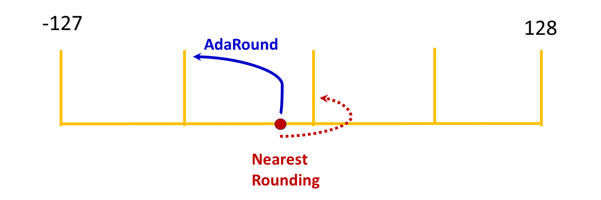

.. _ptq-adaround:

#################
Adaptive rounding
#################

Context
=======
`Adaptive rounding <https://arxiv.org/pdf/2004.10568>`_ (AdaRound) is a rounding mechanism for model weights designed to adapt to the data to improve the accuracy of the quantized model.

By default, AIMET uses nearest rounding for quantization, in which weight values are quantized to the nearest integer value. AdaRound, however, uses training data to determine how to round quantized weights. This technique often improves the accuracy of the quantized model.

The following figure illustrates how AdaRound may alter the rounding of a quantized value.

Workflow
========

Prerequisites
-------------

To use AdaRound, you must:

- Load a trained model
- Create a training or validation dataloader for the model

Workflow
--------

Setup
~~~~~

.. tab-set::
    :sync-group: platform

    .. tab-item:: ONNX
        :sync: onnx

        .. container:: tab-heading

            .. image:: ../images/adaround-workflow.png
                :width: 900px

            Load the model for AdaRound. The following code example converts PyTorch MobileNetV2 to ONNX and uses it in the subsequent code.

        .. literalinclude:: ../snippets/onnx/apply_adaround.py
            :language: python
            :start-after: # Set up model
            :end-before: # End of model

        .. container:: tab-heading

            AdaRound optimization requires an unlabeled dataset.
            This example uses the ImageNet validation data.

        .. literalinclude:: ../snippets/onnx/apply_adaround.py
            :language: python
            :start-after: # Set up dataloader
            :end-before: # End of dataloader

    .. tab-item:: PyTorch
        :sync: torch

        .. image:: ../images/adaround-workflow-torch.png
            :width: 900px

        .. literalinclude:: ../snippets/torch/apply_adaround.py
            :language: python
            :start-after: [setup]
            :end-before: [step_1]

    .. tab-item:: TensorFlow
        :sync: tf

        .. container:: tab-heading

            Load the model for AdaRound. In the following code example, the model is MobileNetV2. 

        .. literalinclude:: ../snippets/tensorflow/apply_adaround.py
            :language: python
            :start-after: # pylint: disable=missing-docstring
            :end-before: # End of model

        .. rst-class:: script-output

          .. code-block:: none

            Model: "mobilenetv2_1.00_224"
            __________________________________________________________________________________________________
             Layer (type)                   Output Shape         Param #     Connected to
            ==================================================================================================
             input_1 (InputLayer)           [(None, 224, 224, 3  0           []
                                            )]

             Conv1 (Conv2D)                 (None, 112, 112, 32  864         ['input_1[0][0]']
                                            )

             bn_Conv1 (BatchNormalization)  (None, 112, 112, 32  128         ['Conv1[0][0]']
                                            )

             Conv1_relu (ReLU)              (None, 112, 112, 32  0           ['bn_Conv1[0][0]']
                                            )

             expanded_conv_depthwise (Depth  (None, 112, 112, 32  288        ['Conv1_relu[0][0]']
             wiseConv2D)                    )
             ...

        .. container:: tab-heading

            AdaRound optimization requires an unlabeled dataset.
            This example uses the ImageNet validation data.

        .. literalinclude:: ../snippets/tensorflow/apply_adaround.py
            :language: python
            :start-after: # Set up dataset
            :end-before: # End of dataset

Step 1
~~~~~~

Apply AdaRound to the model.

.. tab-set::
    :sync-group: platform

    .. tab-item:: ONNX
        :sync: onnx

        .. literalinclude:: ../snippets/onnx/apply_adaround.py
            :language: python
            :start-after: # Step 1
            :end-before: # End of step 1

    .. tab-item:: PyTorch
        :sync: torch

        .. literalinclude:: ../snippets/torch/apply_adaround.py
            :language: python
            :start-after: [step_1]
            :end-before: [step_2]

    .. tab-item:: TensorFlow
        :sync: tf

        .. literalinclude:: ../snippets/tensorflow/apply_adaround.py
            :language: python
            :start-after: # Step 1
            :end-before: # End of step 1

Step 2
~~~~~~

Use AIMET's QuantSim to simulate quantization.

.. tab-set::
    :sync-group: platform

    .. tab-item:: ONNX
        :sync: onnx

        Compute activation encodings after applying adaround.

        .. literalinclude:: ../snippets/onnx/apply_adaround.py
            :language: python
            :start-after: # Step 2
            :end-before: # End of step 2

    .. tab-item:: PyTorch
        :sync: torch

        .. literalinclude:: ../snippets/torch/apply_adaround.py
            :language: python
            :start-after: [step_2]
            :end-before: [step_3]

    .. tab-item:: TensorFlow
        :sync: tf

        .. literalinclude:: ../snippets/tensorflow/apply_adaround.py
            :language: python
            :start-after: # Step 2
            :end-before: # End of step 2

Step 3
~~~~~~

Evaluate the model.

.. tab-set::
    :sync-group: platform

    .. tab-item:: ONNX
        :sync: onnx

        .. literalinclude:: ../snippets/onnx/apply_adaround.py
            :language: python
            :start-after: # Step 3
            :end-before: # End of step 3

    .. tab-item:: PyTorch
        :sync: torch

        .. literalinclude:: ../snippets/torch/apply_adaround.py
            :language: python
            :start-after: [step_3]
            :end-before: [step_4]

    .. tab-item:: TensorFlow
        :sync: tf

        .. literalinclude:: ../snippets/tensorflow/apply_adaround.py
            :language: python
            :start-after: # Step 3
            :end-before: # End of step 3

Step 4
~~~~~~

If AdaRound resulted in satisfactory accuracy, export the model.

.. tab-set::
    :sync-group: platform

    .. tab-item:: ONNX
        :sync: onnx

        .. literalinclude:: ../snippets/onnx/apply_adaround.py
            :language: python
            :start-after: # Step 4
            :end-before: # End of step 4

    .. tab-item:: PyTorch
        :sync: torch

        .. literalinclude:: ../snippets/torch/apply_adaround.py
            :language: python
            :start-after: [step_4]

    .. tab-item:: TensorFlow
        :sync: tf

        .. literalinclude:: ../snippets/tensorflow/apply_adaround.py
            :language: python
            :start-after: # Step 4
            :end-before: # End of step 4

API
===

.. tab-set::
    :sync-group: platform

    .. tab-item:: ONNX
        :sync: onnx

        .. include:: ../apiref/onnx/adaround.rst
           :start-after: # start-after

    .. tab-item:: PyTorch
        :sync: torch

        .. include:: ../apiref/torch/adaround.rst
            :start-after: # start-after

    .. tab-item:: TensorFlow
        :sync: tf

        .. include:: ../apiref/tensorflow/adaround.rst
           :start-after: # start-after
