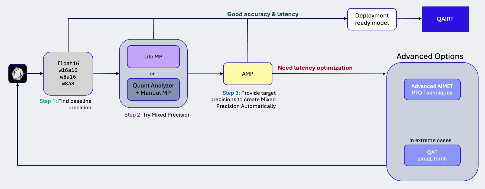

.. include:: ../abbreviation.txt

.. _tutorials-quantization-workflow:

#####################
Quantization workflow
#####################

This page provides a methodology to evaluate and improve the accuracy and performance of machine-learning models on Qualcomm\ |reg| devices using the AI Model Efficiency Toolkit (AIMET).

We recommend the following workflow for quantizing a model to improve its efficiency. 

General guidelines
==================

Preparing a model for deployment on a target device involves a tradeoff between model *accuracy* and on-device *performance*. 

Accuracy is how "correct" the model response is, typically a fraction of responses correct as measured by an evaluation function.

Performance, in an AIMET context, is the ability of a given device to run a model without overtaxing the device compute and memory resources. To evaluate performance improvements, we recommend measuring latency reduction and memory size reduction.

The following procedure follows a strategy of reducing model precision (usually through parameter quantization) only as much as needed to achieve acceptable performance. This reduces the engineering effort required to restore the accuracy lost during quantization. Sometimes this is straightforward. For models with large numbers (billions) of parameters, though, more finesse is required to find this balance, requiring much engineering effort to locate sensitive model layers, fine-tune quantized parameters, and so on. 

Unless you have a reason to do otherwise, we recommend you follow these steps:

1. Try the model at 16-bit floating point (FP16) precision. For some models, this might make *on-target performance* (performance while running on the target device) good enough.
2. Quantize the model weights and activations to 16 bits (W16A16) using AIMET quantization simulation (QuantSim) to verify that quantization does not sharply degrade the the model accuracy.
3. Incrementally reduce the model precision, starting with W8A16. Test model accuracy.
4. If necessary, apply AIMET's accuracy recovery tools, including post-training quantization, mixed precision, or quantization-aware training, to recover accuracy. Retest accuracy.

Procedure
=========

The following sections describe the model preparation steps in more detail.

Step 1: Trying FP16 precision (no quantization)
-----------------------------------------------

We recommend that you start by converting the FP32 model to FP16 precision without quantization. This does not require using AIMET. For instructions on how to compile FP16 models for target runtimes, see |qnn_docs|_ or |qai_hub_docs|_.

Test the model on the target device. If performance is acceptable, there is no need to use AIMET. 

If performance is unacceptable at FP16, the next step is to quantize the model.

Step 2: Verifying W16A16 quantization
-------------------------------------

Quantization at W16A16 should not drastically affect model accuracy. Verify that this is the case for your model.

Add quantization/dequantization (QDQ) nodes to the model using QuantSim. Set weights and activations to 16-bit integer (W16A16). This simulated quantization in the modified floating-point model is called *off-target* quantization. 

Do the following:

1. Ensure that the FP32 model adheres to framework-specific guidelines. For instance, in PyTorch QuantSim can only quantize math operations performed by :class:`torch.nn.Module` objects, while :class:`torch.nn.functional` calls will be incorrectly ignored. See framework-specific pages to learn more about such model guidelines.
2. Once the model conforms to guidelines, create a quantization simulation (QuantSim) version of your model with the bit-width set to 16 bits for both weights and activations (W16A16). See :ref:`<quantsim-workflow>`.
3. Ensure that the original FP32 model and the quantized model (QuantSim object) perform similarly during the forward pass.
4. Compute the off-target quantized accuracy metric for the quantized model and verify that it agrees (approximately) with the FP32 model. If it does not, there might be a problem with the quantization nodes. You can help improve AIMET by reporting an issue to |aimet|_.

Step 3. Reducing precision
--------------------------

To gain on-target performance, you have to reduce precision. We suggest starting with with weights at INT8 precision and activations at INT16 precision (W8A16). Again, the aim is to reduce precision as little as possible to achieve acceptable performance. There's nothing keeping you from trying a more radical reduction in precision if you want, however. Integer precisions supported in AIMET are listed in :ref:`supported_on_target_precisions`.

Step 4. Restoring accuracy
--------------------------

If the off-target quantized accuracy metric is not acceptable, use AIMET's :ref:`userguide-accuracy-improvement-tools` to restore accuracy for the implemented precision.

The decision to try PTQ, mixed precision, or QAT should balance your requirements for runtime accuracy vs. performance. We usually recommend starting with PTQ; QAT is more effective at restoring accuracy but requires more effort to implement. Mixed precision falls somewhere in the middle. See :ref:`featureguide-index` (PTQ), :ref:`techniques-qat` (QAT), and :ref:`featureguide-mp-index`.

You may need experiment here, trying and re-trying different techniques. The more you reduce precision in model, the more work you generally have to do to restore accuracy.

.. image:: ../images/quantization_workflow_5.png

Next: deploying the model
=========================

Once the off-target quantized accuracy is satisfactory, proceed to :ref:`evaluate the
on-target metrics<opt-guide-on-target-inference>` at this precision. If the on-target performance metrics still do not meet your requirements, consider further reducing the precision (for example to W8A8 or W4A8) and repeat the application of Step 4 to optimize the model.

Once the quantized accuracy and runtime requirements are achieved at the desired precision, you can deploy the optimized model on the target runtimes.
